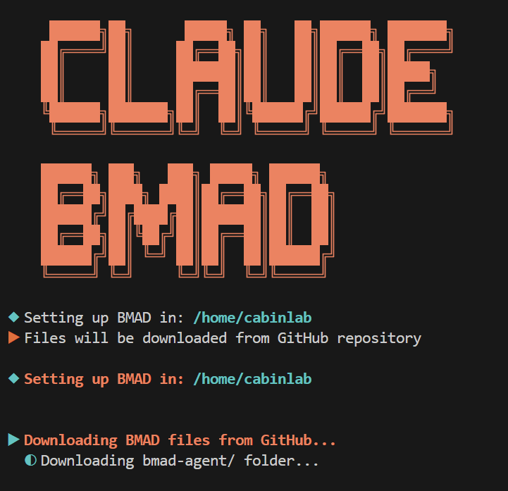
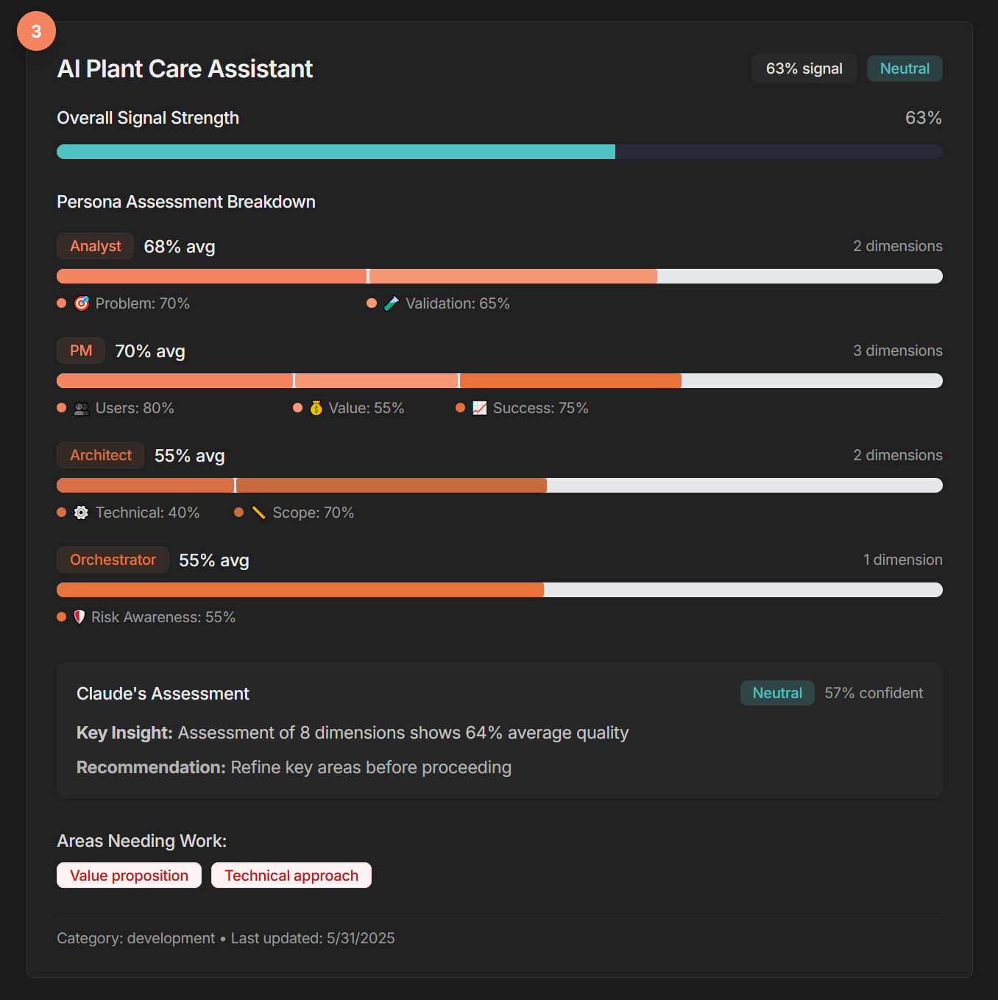

# BMAD-CLAUDE-CODE: The BMAD Method for Claude Code
**Into the unforgiving banality of software development we reflexively march, clutching our glowing API keys like torches against the impenetrable desolation of technical debt.** The BMAD Method - us mad be-ings expedition into the tarred ocean of AI-assisted creation - transforms the milquetoast ritual of "vibe coding" into misty charades evoking a mouth full of chalk and clandestine photographs. Nine specialized personas stand ready, a psychogeographical stonehenge coaxing us into treacherous mountain passes of token gathering, cataclismic tomfoolery, and the final commit: deploying a containerized singularity which compiled once last Thursday.

Here, in this repository, lies our decrepit documentation of the journey - templates gesturing at meaning imposed upon the gaping void, workflows pretending the machine cares about our deadlines, and a methodology born from the quixotic dreams of script kiddies daring to believe AI could hypnotize the savage beast of framework debates.

---

## Core Features

**🎯 Intelligent Claude Code Integration**
- **Smart Persona Routing**: Claude automatically selects the right persona (Analyst, PM, Architect, Designer, Developer, DevOps, QA, Data Engineer, Orchestrator) based on your request
- **Adaptive Formality**: Process rigor adjusts to project complexity - quick fixes skip ceremony, complex features get full rigor
- **Session Continuity**: Multi-session planning with context preservation through documentation-driven workflows

**⚡ Streamlined Development**
- **Direct Task Navigation**: Jump to specific tasks without file browsing - just say what you need
- **Architecture-Agnostic**: Templates support any pattern (monolith, microservices, serverless, edge) without forced assumptions
- **Quality Built-In**: 13 validation checklists and comprehensive templates ensure professional standards

**📊 Visual Progress Tracking**
- **Optional BMAD Dashboard**: Next.js application for visualizing project ideas from exploration through MVP candidates
- **Viability Metrics**: Track business/technical balance with dual progress indicators
- **Anthropic Design**: Consistent branding with Claude Code's design system

## Quick Start



### Automated Setup (Recommended)

Navigate to the root directory of your project and use the setup script to automatically configure BMAD:

**macOS/Linux/WSL:**

Single command (copy and paste entire block):
```bash
curl -O https://raw.githubusercontent.com/cabinlab/BMAD-CLAUDE-CODE/main/setup-bmad.sh && \
chmod +x setup-bmad.sh && \
./setup-bmad.sh
```

**Windows Users:** Since Claude Code requires WSL, run the above bash command in your WSL terminal, not PowerShell.

The script will:
- Copy all necessary BMAD files to your project
- Create the proper directory structure
- Initialize planning journal and session files
- Let you choose between basic and enhanced Claude.md
- **Optional**: Install the BMAD Dashboard for visual progress tracking


## Project Structure

```
your-project/
├── CLAUDE.md                  # Claude Code instructions
├── BMAD-CLAUDE-CODE-GUIDE.md  # Quick reference
├── bmad-agent/                # BMAD assets
│   ├── templates/             # Document templates
│   ├── tasks/                 # Executable tasks
│   ├── checklists/            # Quality checklists
│   └── data/                  # Knowledge base
├── docs/                      # Your project artifacts
│   ├── bmad-journal.md        # Planning history
│   ├── .bmad-session/         # Session continuity
│   ├── project-brief.md       # Vision document
│   ├── prd.md                 # Requirements
│   ├── architecture.md        # Technical design
│   └── stories/               # User stories
├── bmad-dashboard/            # Optional visual dashboard
│   ├── app/                   # Next.js application
│   └── components/            # UI components
└── src/                       # Your code
```

## BMAD Dashboard (Optional)



The BMAD Dashboard provides visual tracking of your project ideas:

### Features
- **Exploration Tracking**: Low-commitment idea validation
- **MVP Ranking**: Prioritized candidates by viability
- **Opportunity Banking**: Validated ideas for future consideration
- **Dual Progress Bars**: Business vs Technical viability visualization
- **Dark Mode**: Automatic theme switching

### Dashboard Setup
If you chose to install the dashboard during setup:
```bash
cd bmad-dashboard
npm install
npm run dev
# Open http://localhost:3001
```


## Documentation

- [CLAUDE.md](CLAUDE.md) - Main instructions for Claude Code
- [CLAUDE-ENHANCED.md](CLAUDE-ENHANCED.md) - Enhanced version with full planning
- [BMAD-CLAUDE-CODE-GUIDE.md](BMAD-CLAUDE-CODE-GUIDE.md) - Quick reference
- [BMAD-SESSION-CONTINUITY.md](BMAD-SESSION-CONTINUITY.md) - Session management

<details>
<summary><strong>📋 Setup Instructions</strong></summary>

### Manual Setup

1. Clone this repository or download the files
2. Copy these to your project root:
   - `bmad-agent/` folder (personas, templates, tasks, checklists, data)
   - `CLAUDE.md` or `CLAUDE-ENHANCED.md` (rename to CLAUDE.md)
   - `BMAD-CLAUDE-CODE-GUIDE.md` (optional quick reference)
3. Create a `docs/` folder in your project for BMAD artifacts
4. Start using BMAD with Claude Code!

### Using BMAD with Claude Code

**Starting a New Project:**
```
User: "Let's plan a new app using BMAD"
Claude Code: I'll help you start a new BMAD project. Let me set up the planning structure...
```

**Continuing Work:**
```
User: "Continue BMAD planning"
Claude Code: I see we were working on the PRD as the Product Manager...
```

**Key Commands:**
- **"Act as the BMAD [Persona]"** - Claude adopts specific persona mindset
- **"Create a [document]"** - Uses appropriate BMAD template
- **"Run [checklist]"** - Executes quality validation
- **"Show planning status"** - Reviews progress and next steps

**Usage Examples:**
- **Direct Requests**: "Build authentication" → [Developer] starts implementation
- **Create Documents**: "Create user stories" → [PM] drafts stories  
- **Design Systems**: "Design the database" → [Data Engineer] creates schema
- **Quality Gates**: "Run architecture checklist" → Validates design decisions

</details>

<details>
<summary><strong>⚙️ Session Management Options</strong></summary>

### Basic Setup (CLAUDE.md)
Use for simple, single-session projects:
- Copy `CLAUDE.md` as-is to your project root
- No session tracking needed  
- Best for small features or quick prototypes
- All planning happens in one session

### Enhanced Setup (CLAUDE-ENHANCED.md)  
For complex, multi-session planning:
- Copy `CLAUDE-ENHANCED.md` to your project root and rename to `CLAUDE.md`
- Includes efficiency enhancements, session continuity, and planning journal support
- Best for full application development with extended planning phases

</details>

<details>
<summary><strong>📚 BMAD Method Details</strong></summary>

### The BMAD Method Philosophy

The BMAD Method is a revolutionary approach that elevates "vibe coding" to advanced project planning, ensuring AI-driven development starts with clear vision and completes with explicit guidance. It provides a structured yet flexible framework to plan, execute, and manage software projects.

#### Key Benefits

- **Structured Planning**: Move from idea to implementation with clear phases
- **Quality Built-In**: Checklists and templates ensure nothing is missed
- **Context Preservation**: Never lose planning decisions across sessions
- **Role-Based Thinking**: Claude Code adopts appropriate mindsets for each phase
- **Document-Driven**: All artifacts are markdown files, easy to review and version

### BMAD Workflow Phases

#### 1. Discovery & Analysis
**Analyst** persona investigates and challenges assumptions:
- Deep research into problem space and constraints
- Competitive analysis and market validation
- Edge case identification and risk assessment

#### 2. Product Definition
**Product Manager** persona transforms research into requirements:
- Creates comprehensive PRD with prioritized features
- Defines user stories with clear acceptance criteria
- Establishes success metrics and MVP scope

#### 3. Technical & UX Design
**Architect** and **Designer** personas create system design:
- Architecture patterns for scalability and maintainability
- API specifications and security modeling
- User experience flows and interface design

#### 4. Implementation & Quality
**Developer** persona builds the solution:
- Clean code implementation following best practices
- Debugging and refactoring for maintainability
- Technical documentation and code reviews

**QA Engineer** persona ensures quality:
- Test strategy design and test automation
- Performance and security testing
- Independent quality validation

#### 5. Data Management
**Data Engineer** persona architects information flow:
- Database schema design and optimization
- Data migration and ETL pipeline creation
- Privacy compliance and data governance

#### 6. Infrastructure & Operations
**DevOps Engineer** persona enables deployment:
- CI/CD pipeline setup and automation
- Infrastructure design and monitoring
- Security hardening and cost optimization

#### 7. Process & Continuity
**Orchestrator** persona maintains project discipline:
- Quality gates and validation checkpoints
- Change management and course correction
- Session continuity and knowledge preservation

</details>

<details>
<summary><strong>🛠️ Available Resources</strong></summary>

### Templates (`bmad-agent/templates/`) - 10 Total
**Core Templates:**
- `project-brief-tmpl.md` - Vision and problem definition
- `prd-tmpl.md` - Product requirements with pattern guidance
- `architecture-tmpl.md` - System design with architecture patterns
- `story-tmpl.md` - User stories with comprehensive DoD

**Specialized Templates:**
- `front-end-architecture-tmpl.md` - Frontend technical design
- `front-end-spec-tmpl.md` - UI/UX specifications
- `test-strategy-tmpl.md` - Comprehensive testing approach
- `session-state-tmpl.md` - Session continuity tracking
- `planning-journal-tmpl.md` - Decision history across sessions
- `doc-sharding-tmpl.md` - Documentation organization

### Tasks (`bmad-agent/tasks/`) - 19 Total
**Core Tasks:**
- `create-prd.md` - Requirements definition
- `create-architecture.md` - System design
- `create-next-story.md` - User story creation
- `create-deep-research.md` - Investigation and analysis

**Design & Architecture Tasks:**
- `create-api-specification.md` - API design and contracts
- `create-frontend-architecture.md` - Frontend system design
- `create-ui-specification.md` - UI/UX design specifications
- `create-database-design.md` - Database schema design
- `security-threat-model.md` - Security analysis

**Implementation Tasks:**
- `implement-story.md` - Guided code implementation
- `create-test-strategy.md` - Comprehensive testing approach
- `generate-tests.md` - Comprehensive test creation
- `debug-issue.md` - Systematic debugging
- `create-deployment-pipeline.md` - CI/CD setup
- `create-data-migration-strategy.md` - Data migration planning

**Process Tasks:**
- `coordinate-multi-persona-feature.md` - Multi-persona coordination
- `correct-course.md` - Change management
- `core-dump.md` - Session memory capture
- `checklist-run-task.md` - Quality gate execution

### Checklists (`bmad-agent/checklists/`) - 13 Total
**Product & Requirements:**
- `pm-checklist.md` - PRD quality validation
- `po-master-checklist.md` - Backlog readiness
- `story-draft-checklist.md` - Story quality validation
- `story-dod-checklist.md` - Definition of Done

**Architecture & Design:**
- `architect-checklist.md` - System architecture review
- `frontend-architecture-checklist.md` - Frontend design validation
- `api-design-checklist.md` - API specification quality
- `security-threat-model-checklist.md` - Security analysis validation

**Implementation & Quality:**
- `implementation-quality-checklist.md` - Code quality standards
- `test-suite-quality-checklist.md` - Test coverage validation
- `deployment-pipeline-checklist.md` - CI/CD quality validation
- `debug-process-checklist.md` - Issue resolution validation
- `change-checklist.md` - Change management validation

### Getting Started Examples

**Example 1: Starting Fresh**
```
User: "I want to build a task management app using BMAD"
Claude Code: I'll help you start a new BMAD project for your task management app. 
Let me set up the planning structure and begin with discovery...
```

**Example 2: Continuing Work**
```
User: "Continue BMAD planning"
Claude Code: I see we were working on Epic 2 of your PRD. Last session we completed 
the user authentication stories. Shall we continue with the task management stories?
```

**Example 3: Running Checklists**
```
User: "Run the architecture checklist"
Claude Code: I'll run through the architecture checklist for your current design.
Let's validate each aspect...
```

</details>

## Contributing

This fork is very experimental, and probably not at a point contributions make sense.


## Credits

BMAD-CLAUDE-CODE is a fork of the original [BMAD-METHOD](https://github.com/bmadcode/BMAD-METHOD) by bmadcode, adapted specifically for Claude Code users.

## License

[MIT License](./docs/LICENSE)
